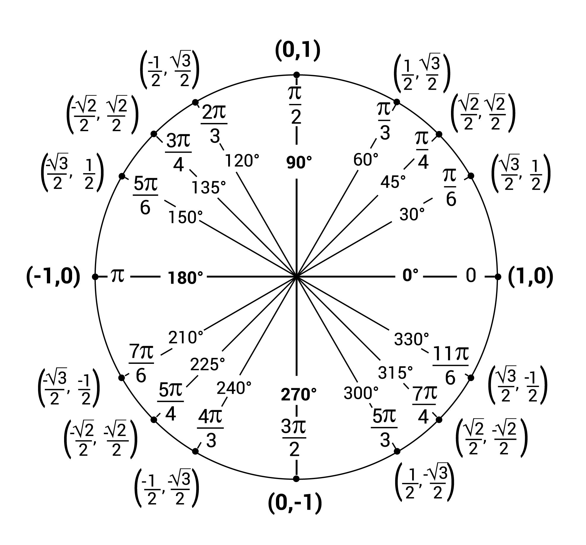

```{r global-options, include=FALSE}
library(tidyverse)
library(patchwork)

theme_set(theme_bw(base_size = 16))
```

```{css}
code.sourceCode {
  font-size: 1.3em;
  /* or try font-size: xx-large; */
}

a {
  color: purple;
}

a:link {
  color: purple;
}

a:visited {
  color: purple;
}
```

## Reminders

<div style="font-size:16pt">

:::{.fragment}

Last class we completed our study of exponential and logarithmic functions. Today we begin **trigonometry** — the final major topic of the semester.

:::

:::{.fragment}

Try the following warm-up problems as review, challenge, and bridge.

:::

:::{.fragment}

**Problem 1:** A projectile is launched vertically from ground level, with initial velocity 64 feet per second. The height (in feet) of the projectile after $t$ seconds is given by the function $h\left(t\right) = -16t^2 + 64t$. Find the maximum height of the projectile and the time at which it reaches that height.

:::

:::{.fragment}

**Problem 2:** Solve $\displaystyle{e^{2x} - 5e^x + 6 = 0}$.

:::

:::{.fragment}

**Problem 3:** Consider the projectile from the first problem. How does the scenario change if the projectile is launched at a $60°$ angle instead of vertically? Are the answers the same? Why or why not? What do you need to know in order to solve this updated problem?

:::

</div>

## Objectives

:::{.fragment}

Trigonometry connects angles to lengths and coordinates. It is the mathematical language of anything that rotates, oscillates, or repeats — from sound waves to planetary orbits to signal processing.

:::

:::{.fragment}

After today's class meeting, you should be able to:

:::

+ Measure angles in both degrees and radians and convert between the two.
+ Identify coterminal angles and find a coterminal angle in $\left[0°, 360°\right)$ or $\left[0, 2\pi\right)$.
+ Use the unit circle to evaluate $\sin\left(\right)$, $\cos\left(\right)$, and $\tan\left(\right)$ at common angles.
+ Evaluate trigonometric functions at angles outside $\left[0°, 360°\right)$ using coterminal angles.

## The Unit Circle

<div style="font-size:16pt">

:::{.fragment}

The **unit circle** is a circle of radius $1$, centered at the origin. It is the foundation of trigonometry.

:::

:::{.fragment}

Each point on the unit circle corresponds to an angle $\theta$ measured from the positive $x$-axis, and is labeled with its coordinates $\left(x, y\right)$.

:::

:::{.fragment}

The unit circle includes the angles that are multiples of $30°$ $\left(\text{or }\frac{\pi}{6}\text{ rad}\right)$ and multiples of $45°$ $\left(\text{or }\frac{\pi}{4}\text{ rad}\right)$ — the angle increments you will encounter most often.

:::

:::{.fragment}

{width="45%"}

:::

</div>

## Degree and Radian Measure

<div style="font-size:16pt">

:::{.fragment}

There are two standard units for measuring angles.

:::

:::{.fragment}

**Degrees:** A full revolution around a circle measures $360°$. This is the unit most familiar from everyday life.

:::

:::{.fragment}

**Radians:** A full revolution around a circle is $2\pi$ rad. *Radians* are the natural unit for mathematics — many formulas in calculus and beyond require radian measure.

:::

:::{.fragment}

**Converting between the two** uses the fact that $360° = 2\pi$ rad, so the ratio $\dfrac{2\pi~\text{rad}}{360°} = 1$:

:::

:::{.fragment}

$$d° = d° \cdot \frac{2\pi~\text{rad}}{360°} \qquad \text{and} \qquad r~\text{rad} = r~\text{rad} \cdot \frac{360°}{2\pi~\text{rad}}$$

:::

:::{.fragment}

**Sign and direction:** Angles are measured from the positive $x$-axis. Counter-clockwise is the positive direction; clockwise is negative. Angles with measure exceeding $360°$ (or less than $-360°$) represent more than one full revolution.

:::

</div>

## Converting Angles

<div style="font-size:16pt">

:::{.fragment}

**Example 1:** $\left(1\right)$ Convert $135°$ to radians. $\quad\left(2\right)$ Convert $\dfrac{11\pi}{6}$ rad to degrees.

:::

::::{.columns}

:::{.column width="50%"}

:::{.fragment}

**(1)** Multiply by the degree-to-radian conversion factor.

:::

:::{.fragment}

\begin{align} 135°
\end{align}

:::

:::

:::{.column width="50%"}

:::

::::

</div>

## Converting Angles

<div style="font-size:16pt">

**Example 1:** $\left(1\right)$ Convert $135°$ to radians. $\quad\left(2\right)$ Convert $\dfrac{11\pi}{6}$ rad to degrees.

::::{.columns}

:::{.column width="50%"}

**(1)** Multiply by the degree-to-radian conversion factor.

\begin{align} 135° &= 135°\left(\frac{2\pi~\text{rad}}{360°}\right)
\end{align}

:::

:::{.column width="50%"}

:::

::::

</div>

## Converting Angles

<div style="font-size:16pt">

**Example 1:** $\left(1\right)$ Convert $135°$ to radians. $\quad\left(2\right)$ Convert $\dfrac{11\pi}{6}$ rad to degrees.

::::{.columns}

:::{.column width="50%"}

**(1)** Multiply by the degree-to-radian conversion factor.

\begin{align} 135° &= 135°\left(\frac{2\pi~\text{rad}}{360°}\right)\\
&= \frac{270\pi}{360}
\end{align}

:::

:::{.column width="50%"}

:::

::::

</div>

## Converting Angles

<div style="font-size:16pt">

**Example 1:** $\left(1\right)$ Convert $135°$ to radians. $\quad\left(2\right)$ Convert $\dfrac{11\pi}{6}$ rad to degrees.

::::{.columns}

:::{.column width="50%"}

**(1)** Multiply by the degree-to-radian conversion factor.

\begin{align} 135° &= 135°\left(\frac{2\pi~\text{rad}}{360°}\right)\\
&= \frac{270\pi}{360}\\
&= \frac{27\pi}{36}
\end{align}

:::

:::{.column width="50%"}

:::

::::

</div>

## Converting Angles

<div style="font-size:16pt">

**Example 1:** $\left(1\right)$ Convert $135°$ to radians. $\quad\left(2\right)$ Convert $\dfrac{11\pi}{6}$ rad to degrees.

::::{.columns}

:::{.column width="50%"}

**(1)** Multiply by the degree-to-radian conversion factor.

\begin{align} 135° &= 135°\left(\frac{2\pi~\text{rad}}{360°}\right)\\
&= \frac{270\pi}{360}\\
&= \frac{27\pi}{36}\\
&= \boxed{~\frac{3\pi}{4}~}
\end{align}

:::

:::{.column width="50%"}

:::{.fragment}

**(2)** Multiply by the radian-to-degree conversion factor.

:::

:::{.fragment}

\begin{align} \frac{11\pi}{6}~\text{rad}
\end{align}

:::

:::

::::

</div>

## Converting Angles

<div style="font-size:16pt">

**Example 1:** $\left(1\right)$ Convert $135°$ to radians. $\quad\left(2\right)$ Convert $\dfrac{11\pi}{6}$ rad to degrees.

::::{.columns}

:::{.column width="50%"}

**(1)** Multiply by the degree-to-radian conversion factor.

\begin{align} 135° &= 135°\left(\frac{2\pi~\text{rad}}{360°}\right)\\
&= \frac{270\pi}{360}\\
&= \frac{27\pi}{36}\\
&= \boxed{~\frac{3\pi}{4}~}
\end{align}

:::

:::{.column width="50%"}

**(2)** Multiply by the radian-to-degree conversion factor.

\begin{align} \frac{11\pi}{6}~\text{rad} &= \left(\frac{11\pi}{6}~\text{rad}\right)\left(\frac{360°}{2\pi~\text{rad}}\right)
\end{align}

:::

::::

</div>

## Converting Angles

<div style="font-size:16pt">

**Example 1:** $\left(1\right)$ Convert $135°$ to radians. $\quad\left(2\right)$ Convert $\dfrac{11\pi}{6}$ rad to degrees.

::::{.columns}

:::{.column width="50%"}

**(1)** Multiply by the degree-to-radian conversion factor.

\begin{align} 135° &= 135°\left(\frac{2\pi~\text{rad}}{360°}\right)\\
&= \frac{270\pi}{360}\\
&= \frac{27\pi}{36}\\
&= \boxed{~\frac{3\pi}{4}~}
\end{align}

:::

:::{.column width="50%"}

**(2)** Multiply by the radian-to-degree conversion factor.

\begin{align} \frac{11\pi}{6}~\text{rad} &= \left(\frac{11\pi}{6}~\text{rad}\right)\left(\frac{360°}{2\pi~\text{rad}}\right)\\
&= \frac{11\cdot 360°}{12}
\end{align}

:::

::::

</div>

## Converting Angles

<div style="font-size:16pt">

**Example 1:** $\left(1\right)$ Convert $135°$ to radians. $\quad\left(2\right)$ Convert $\dfrac{11\pi}{6}$ rad to degrees.

::::{.columns}

:::{.column width="50%"}

**(1)** Multiply by the degree-to-radian conversion factor.

\begin{align} 135° &= 135°\left(\frac{2\pi~\text{rad}}{360°}\right)\\
&= \frac{270\pi}{360}\\
&= \frac{27\pi}{36}\\
&= \boxed{~\frac{3\pi}{4}~}
\end{align}

:::

:::{.column width="50%"}

**(2)** Multiply by the radian-to-degree conversion factor.

\begin{align} \frac{11\pi}{6}~\text{rad} &= \left(\frac{11\pi}{6}~\text{rad}\right)\left(\frac{360°}{2\pi~\text{rad}}\right)\\
&= \frac{11\cdot 360°}{12}\\
&= 11\cdot 30°
\end{align}

:::

::::

</div>

## Converting Angles

<div style="font-size:16pt">

**Example 1:** $\left(1\right)$ Convert $135°$ to radians. $\quad\left(2\right)$ Convert $\dfrac{11\pi}{6}$ rad to degrees.

::::{.columns}

:::{.column width="50%"}

**(1)** Multiply by the degree-to-radian conversion factor.

\begin{align} 135° &= 135°\left(\frac{2\pi~\text{rad}}{360°}\right)\\
&= \frac{270\pi}{360}\\
&= \frac{27\pi}{36}\\
&= \boxed{~\frac{3\pi}{4}~}
\end{align}

:::

:::{.column width="50%"}

**(2)** Multiply by the radian-to-degree conversion factor.

\begin{align} \frac{11\pi}{6}~\text{rad} &= \left(\frac{11\pi}{6}~\text{rad}\right)\left(\frac{360°}{2\pi~\text{rad}}\right)\\
&= \frac{11\cdot 360°}{12}\\
&= 11\cdot 30°\\
&= \boxed{~330°~}
\end{align}

:::

::::

</div>

## Angle Conversion Practice

<div style="font-size:17pt">

**Try It! 1:** Complete the following conversions.

<br/>

$\left(a\right)$ Convert $780°$ to radians.

<br/>

$\left(b\right)$ Convert $-50°$ to radians.

<br/>

$\left(c\right)$ Convert $3\pi$ rad to degrees.

<br/>

$\left(d\right)$ Convert $\displaystyle{-\frac{\pi}{5}}$ rad to degrees.

</div>

## The Six Trigonometric Functions

<div style="font-size:16pt">

:::{.fragment}

For an angle $\theta$ whose terminal side intersects the unit circle at the point $\left(x, y\right)$, we define:

:::

::::{.columns}

:::{.column width="50%"}

:::{.fragment}

$$\begin{array}{lll}
\sin\!\left(\theta\right) = y & \quad & \csc\!\left(\theta\right) = \dfrac{1}{y}\\[10pt]
\cos\!\left(\theta\right) = x & \quad & \sec\!\left(\theta\right) = \dfrac{1}{x}\\[10pt]
\tan\!\left(\theta\right) = \dfrac{y}{x} & \quad & \cot\!\left(\theta\right) = \dfrac{x}{y}
\end{array}$$

:::

:::

:::{.column width="50%"}

:::{.fragment}


:::

:::

::::

:::{.fragment}

Since $x$ and $y$ are coordinates on the unit circle, $\sin$ and $\cos$ always satisfy $-1 \leq \sin\!\left(\theta\right) \leq 1$ and $-1 \leq \cos\!\left(\theta\right) \leq 1$.

:::

:::{.fragment}

Note that $\tan$, $\sec$, $\csc$, and $\cot$ are undefined whenever their denominator is zero.

:::

</div>

## Evaluating Trig Functions

<div style="font-size:16pt">

:::{.fragment}

**Example 2:** Evaluate each of the following using the unit circle.

$$\left(a\right)~\sin\!\left(\frac{5\pi}{6}\right) \qquad \left(b\right)~\cos\!\left(\frac{4\pi}{3}\right) \qquad \left(c\right)~\tan\!\left(\frac{7\pi}{6}\right) \qquad \left(d\right)~\cos\!\left(135°\right) \qquad \left(e\right)~\tan\!\left(225°\right)$$

:::

::::{.columns}

:::{.column width="33%"}

:::{.fragment}

**(a)** $\displaystyle{\frac{5\pi}{6}}$ 

:::

:::

:::{.column width="33%"}

:::

:::{.column width="33%"}

:::

::::

</div>

## Evaluating Trig Functions

<div style="font-size:16pt">

**Example 2:** Evaluate each of the following using the unit circle.

$$\left(a\right)~\sin\!\left(\frac{5\pi}{6}\right) \qquad \left(b\right)~\cos\!\left(\frac{4\pi}{3}\right) \qquad \left(c\right)~\tan\!\left(\frac{7\pi}{6}\right) \qquad \left(d\right)~\cos\!\left(135°\right) \qquad \left(e\right)~\tan\!\left(225°\right)$$

::::{.columns}

:::{.column width="33%"}

**(a)** $\displaystyle{\frac{5\pi}{6}}$ is in QII.

:::

:::{.column width="33%"}

:::

:::{.column width="33%"}

:::

::::

</div>

## Evaluating Trig Functions

<div style="font-size:16pt">

**Example 2:** Evaluate each of the following using the unit circle.

$$\left(a\right)~\sin\!\left(\frac{5\pi}{6}\right) \qquad \left(b\right)~\cos\!\left(\frac{4\pi}{3}\right) \qquad \left(c\right)~\tan\!\left(\frac{7\pi}{6}\right) \qquad \left(d\right)~\cos\!\left(135°\right) \qquad \left(e\right)~\tan\!\left(225°\right)$$

::::{.columns}

:::{.column width="33%"}

**(a)** $\displaystyle{\frac{5\pi}{6}}$ is in QII. The point on the unit circle is $\displaystyle{\left(-\frac{\sqrt{3}}{2}, \frac{1}{2}\right)}$.

:::{.fragment}

$$\sin\left(\frac{5\pi}{6}\right) = \boxed{~\frac{1}{2}~}$$

:::

:::{.fragment}

**(b)** $\displaystyle{\frac{4\pi}{3}}$

:::

:::

:::{.column width="33%"}

:::

:::{.column width="33%"}

:::

::::

</div>

## Evaluating Trig Functions

<div style="font-size:16pt">

**Example 2:** Evaluate each of the following using the unit circle.

$$\left(a\right)~\sin\!\left(\frac{5\pi}{6}\right) \qquad \left(b\right)~\cos\!\left(\frac{4\pi}{3}\right) \qquad \left(c\right)~\tan\!\left(\frac{7\pi}{6}\right) \qquad \left(d\right)~\cos\!\left(135°\right) \qquad \left(e\right)~\tan\!\left(225°\right)$$

::::{.columns}

:::{.column width="33%"}

**(a)** $\displaystyle{\frac{5\pi}{6}}$ is in QII. The point on the unit circle is $\displaystyle{\left(-\frac{\sqrt{3}}{2}, \frac{1}{2}\right)}$.

$$\sin\left(\frac{5\pi}{6}\right) = \boxed{~\frac{1}{2}~}$$

**(b)** $\displaystyle{\frac{4\pi}{3}}$ is in QIII.

:::

:::{.column width="33%"}

:::

:::{.column width="33%"}

:::

::::

</div>

## Evaluating Trig Functions

<div style="font-size:16pt">

**Example 2:** Evaluate each of the following using the unit circle.

$$\left(a\right)~\sin\!\left(\frac{5\pi}{6}\right) \qquad \left(b\right)~\cos\!\left(\frac{4\pi}{3}\right) \qquad \left(c\right)~\tan\!\left(\frac{7\pi}{6}\right) \qquad \left(d\right)~\cos\!\left(135°\right) \qquad \left(e\right)~\tan\!\left(225°\right)$$

::::{.columns}

:::{.column width="33%"}

**(a)** $\displaystyle{\frac{5\pi}{6}}$ is in QII. The point on the unit circle is $\displaystyle{\left(-\frac{\sqrt{3}}{2}, \frac{1}{2}\right)}$.

$$\sin\left(\frac{5\pi}{6}\right) = \boxed{~\frac{1}{2}~}$$

**(b)** $\displaystyle{\frac{4\pi}{3}}$ is in QIII. The point is $\displaystyle{\left(-\frac{1}{2}, -\frac{\sqrt{3}}{2}\right)}$.

:::{.fragment}

$$\cos\left(\frac{4\pi}{3}\right) = \boxed{~\frac{-1}{2}~}$$

:::

:::

:::{.column width="33%"}

:::{.fragment}

**(c)** $\displaystyle{\frac{7\pi}{6}}$

:::

:::

:::{.column width="33%"}

:::

::::

</div>

## Evaluating Trig Functions

<div style="font-size:16pt">

**Example 2:** Evaluate each of the following using the unit circle.

$$\left(a\right)~\sin\!\left(\frac{5\pi}{6}\right) \qquad \left(b\right)~\cos\!\left(\frac{4\pi}{3}\right) \qquad \left(c\right)~\tan\!\left(\frac{7\pi}{6}\right) \qquad \left(d\right)~\cos\!\left(135°\right) \qquad \left(e\right)~\tan\!\left(225°\right)$$

::::{.columns}

:::{.column width="33%"}

**(a)** $\displaystyle{\frac{5\pi}{6}}$ is in QII. The point on the unit circle is $\displaystyle{\left(-\frac{\sqrt{3}}{2}, \frac{1}{2}\right)}$.

$$\sin\left(\frac{5\pi}{6}\right) = \boxed{~\frac{1}{2}~}$$

**(b)** $\displaystyle{\frac{4\pi}{3}}$ is in QIII. The point is $\displaystyle{\left(-\frac{1}{2}, -\frac{\sqrt{3}}{2}\right)}$.

$$\cos\left(\frac{4\pi}{3}\right) = \boxed{~\frac{-1}{2}~}$$

:::

:::{.column width="33%"}

**(c)** $\displaystyle{\frac{7\pi}{6}}$ is in QIII.

:::

:::{.column width="33%"}

:::

::::

</div>

## Evaluating Trig Functions

<div style="font-size:16pt">

**Example 2:** Evaluate each of the following using the unit circle.

$$\left(a\right)~\sin\!\left(\frac{5\pi}{6}\right) \qquad \left(b\right)~\cos\!\left(\frac{4\pi}{3}\right) \qquad \left(c\right)~\tan\!\left(\frac{7\pi}{6}\right) \qquad \left(d\right)~\cos\!\left(135°\right) \qquad \left(e\right)~\tan\!\left(225°\right)$$

::::{.columns}

:::{.column width="33%"}

**(a)** $\displaystyle{\frac{5\pi}{6}}$ is in QII. The point on the unit circle is $\displaystyle{\left(-\frac{\sqrt{3}}{2}, \frac{1}{2}\right)}$.

$$\sin\left(\frac{5\pi}{6}\right) = \boxed{~\frac{1}{2}~}$$

**(b)** $\displaystyle{\frac{4\pi}{3}}$ is in QIII. The point is $\displaystyle{\left(-\frac{1}{2}, -\frac{\sqrt{3}}{2}\right)}$.

$$\cos\left(\frac{4\pi}{3}\right) = \boxed{~\frac{-1}{2}~}$$

:::

:::{.column width="33%"}

**(c)** $\displaystyle{\frac{7\pi}{6}}$ is in QIII. The point is $\displaystyle{\left(-\frac{\sqrt{3}}{2}, -\frac{1}{2}\right)}$.

:::{.fragment}

$$\tan\left(\frac{7\pi}{6}\right) = \frac{-1/2}{-\sqrt{3}/2}$$

:::

:::

:::{.column width="33%"}

:::

::::

</div>

## Evaluating Trig Functions

<div style="font-size:16pt">

**Example 2:** Evaluate each of the following using the unit circle.

$$\left(a\right)~\sin\!\left(\frac{5\pi}{6}\right) \qquad \left(b\right)~\cos\!\left(\frac{4\pi}{3}\right) \qquad \left(c\right)~\tan\!\left(\frac{7\pi}{6}\right) \qquad \left(d\right)~\cos\!\left(135°\right) \qquad \left(e\right)~\tan\!\left(225°\right)$$

::::{.columns}

:::{.column width="33%"}

**(a)** $\displaystyle{\frac{5\pi}{6}}$ is in QII. The point on the unit circle is $\displaystyle{\left(-\frac{\sqrt{3}}{2}, \frac{1}{2}\right)}$.

$$\sin\left(\frac{5\pi}{6}\right) = \boxed{~\frac{1}{2}~}$$

**(b)** $\displaystyle{\frac{4\pi}{3}}$ is in QIII. The point is $\displaystyle{\left(-\frac{1}{2}, -\frac{\sqrt{3}}{2}\right)}$.

$$\cos\left(\frac{4\pi}{3}\right) = \boxed{~\frac{-1}{2}~}$$

:::

:::{.column width="33%"}

**(c)** $\displaystyle{\frac{7\pi}{6}}$ is in QIII. The point is $\displaystyle{\left(-\frac{\sqrt{3}}{2}, -\frac{1}{2}\right)}$.

$$\tan\left(\frac{7\pi}{6}\right) = \frac{-1/2}{-\sqrt{3}/2} = \boxed{~\frac{1}{\sqrt{3}}~}$$

:::

:::{.column width="33%"}

:::{.fragment}

**(d)** $\displaystyle{135°}$

:::

:::

::::

</div>

## Evaluating Trig Functions

<div style="font-size:16pt">

**Example 2:** Evaluate each of the following using the unit circle.

$$\left(a\right)~\sin\!\left(\frac{5\pi}{6}\right) \qquad \left(b\right)~\cos\!\left(\frac{4\pi}{3}\right) \qquad \left(c\right)~\tan\!\left(\frac{7\pi}{6}\right) \qquad \left(d\right)~\cos\!\left(135°\right) \qquad \left(e\right)~\tan\!\left(225°\right)$$

::::{.columns}

:::{.column width="33%"}

**(a)** $\displaystyle{\frac{5\pi}{6}}$ is in QII. The point on the unit circle is $\displaystyle{\left(-\frac{\sqrt{3}}{2}, \frac{1}{2}\right)}$.

$$\sin\left(\frac{5\pi}{6}\right) = \boxed{~\frac{1}{2}~}$$

**(b)** $\displaystyle{\frac{4\pi}{3}}$ is in QIII. The point is $\displaystyle{\left(-\frac{1}{2}, -\frac{\sqrt{3}}{2}\right)}$.

$$\cos\left(\frac{4\pi}{3}\right) = \boxed{~\frac{-1}{2}~}$$

:::

:::{.column width="33%"}

**(c)** $\displaystyle{\frac{7\pi}{6}}$ is in QIII. The point is $\displaystyle{\left(-\frac{\sqrt{3}}{2}, -\frac{1}{2}\right)}$.

$$\tan\left(\frac{7\pi}{6}\right) = \frac{-1/2}{-\sqrt{3}/2} = \boxed{~\frac{1}{\sqrt{3}}~}$$

:::

:::{.column width="33%"}

**(d)** $\displaystyle{135°}$ is in QII.

:::

::::

</div>

## Evaluating Trig Functions

<div style="font-size:16pt">

**Example 2:** Evaluate each of the following using the unit circle.

$$\left(a\right)~\sin\!\left(\frac{5\pi}{6}\right) \qquad \left(b\right)~\cos\!\left(\frac{4\pi}{3}\right) \qquad \left(c\right)~\tan\!\left(\frac{7\pi}{6}\right) \qquad \left(d\right)~\cos\!\left(135°\right) \qquad \left(e\right)~\tan\!\left(225°\right)$$

::::{.columns}

:::{.column width="33%"}

**(a)** $\displaystyle{\frac{5\pi}{6}}$ is in QII. The point on the unit circle is $\displaystyle{\left(-\frac{\sqrt{3}}{2}, \frac{1}{2}\right)}$.

$$\sin\left(\frac{5\pi}{6}\right) = \boxed{~\frac{1}{2}~}$$

**(b)** $\displaystyle{\frac{4\pi}{3}}$ is in QIII. The point is $\displaystyle{\left(-\frac{1}{2}, -\frac{\sqrt{3}}{2}\right)}$.

$$\cos\left(\frac{4\pi}{3}\right) = \boxed{~\frac{-1}{2}~}$$

:::

:::{.column width="33%"}

**(c)** $\displaystyle{\frac{7\pi}{6}}$ is in QIII. The point is $\displaystyle{\left(-\frac{\sqrt{3}}{2}, -\frac{1}{2}\right)}$.

$$\tan\left(\frac{7\pi}{6}\right) = \frac{-1/2}{-\sqrt{3}/2} = \boxed{~\frac{1}{\sqrt{3}}~}$$

:::

:::{.column width="33%"}

**(d)** $\displaystyle{135°}$ is in QII. The point is $\displaystyle{\left(-\frac{\sqrt{2}}{2}, \frac{\sqrt{2}}{2}\right)}$.

:::{.fragment}

$$\cos\left(135°\right) = \boxed{~-\frac{\sqrt{2}}{2}~}$$ 

:::

:::{.fragment}

**(e)** $\displaystyle{225°}$

:::

:::

::::

</div>

## Evaluating Trig Functions

<div style="font-size:16pt">

**Example 2:** Evaluate each of the following using the unit circle.

$$\left(a\right)~\sin\!\left(\frac{5\pi}{6}\right) \qquad \left(b\right)~\cos\!\left(\frac{4\pi}{3}\right) \qquad \left(c\right)~\tan\!\left(\frac{7\pi}{6}\right) \qquad \left(d\right)~\cos\!\left(135°\right) \qquad \left(e\right)~\tan\!\left(225°\right)$$

::::{.columns}

:::{.column width="33%"}

**(a)** $\displaystyle{\frac{5\pi}{6}}$ is in QII. The point on the unit circle is $\displaystyle{\left(-\frac{\sqrt{3}}{2}, \frac{1}{2}\right)}$.

$$\sin\left(\frac{5\pi}{6}\right) = \boxed{~\frac{1}{2}~}$$

**(b)** $\displaystyle{\frac{4\pi}{3}}$ is in QIII. The point is $\displaystyle{\left(-\frac{1}{2}, -\frac{\sqrt{3}}{2}\right)}$.

$$\cos\left(\frac{4\pi}{3}\right) = \boxed{~\frac{-1}{2}~}$$

:::

:::{.column width="33%"}

**(c)** $\displaystyle{\frac{7\pi}{6}}$ is in QIII. The point is $\displaystyle{\left(-\frac{\sqrt{3}}{2}, -\frac{1}{2}\right)}$.

$$\tan\left(\frac{7\pi}{6}\right) = \frac{-1/2}{-\sqrt{3}/2} = \boxed{~\frac{1}{\sqrt{3}}~}$$

:::

:::{.column width="33%"}

**(d)** $\displaystyle{135°}$ is in QII. The point is $\displaystyle{\left(-\frac{\sqrt{2}}{2}, \frac{\sqrt{2}}{2}\right)}$.

$$\cos\left(135°\right) = \boxed{~-\frac{\sqrt{2}}{2}~}$$ 

**(e)** $\displaystyle{225°}$ is in QIII.

:::

::::

</div>

## Evaluating Trig Functions

<div style="font-size:16pt">

**Example 2:** Evaluate each of the following using the unit circle.

$$\left(a\right)~\sin\!\left(\frac{5\pi}{6}\right) \qquad \left(b\right)~\cos\!\left(\frac{4\pi}{3}\right) \qquad \left(c\right)~\tan\!\left(\frac{7\pi}{6}\right) \qquad \left(d\right)~\cos\!\left(135°\right) \qquad \left(e\right)~\tan\!\left(225°\right)$$

::::{.columns}

:::{.column width="33%"}

**(a)** $\displaystyle{\frac{5\pi}{6}}$ is in QII. The point on the unit circle is $\displaystyle{\left(-\frac{\sqrt{3}}{2}, \frac{1}{2}\right)}$.

$$\sin\left(\frac{5\pi}{6}\right) = \boxed{~\frac{1}{2}~}$$

**(b)** $\displaystyle{\frac{4\pi}{3}}$ is in QIII. The point is $\displaystyle{\left(-\frac{1}{2}, -\frac{\sqrt{3}}{2}\right)}$.

$$\cos\left(\frac{4\pi}{3}\right) = \boxed{~\frac{-1}{2}~}$$

:::

:::{.column width="33%"}

**(c)** $\displaystyle{\frac{7\pi}{6}}$ is in QIII. The point is $\displaystyle{\left(-\frac{\sqrt{3}}{2}, -\frac{1}{2}\right)}$.

$$\tan\left(\frac{7\pi}{6}\right) = \frac{-1/2}{-\sqrt{3}/2} = \boxed{~\frac{1}{\sqrt{3}}~}$$

:::

:::{.column width="33%"}

**(d)** $\displaystyle{135°}$ is in QII. The point is $\displaystyle{\left(-\frac{\sqrt{2}}{2}, \frac{\sqrt{2}}{2}\right)}$.

$$\cos\left(135°\right) = \boxed{~-\frac{\sqrt{2}}{2}~}$$ 

**(e)** $\displaystyle{225°}$ is in QIII. The point is $\displaystyle{\left(-\frac{\sqrt{2}}{2}, -\frac{\sqrt{2}}{2}\right)}$.

:::{.fragment}

$$\tan\left(225°\right) = \frac{-\sqrt{2}/2}{-\sqrt{2}/2}$$

:::

:::

::::

</div>

## Evaluating Trig Functions

<div style="font-size:16pt">

**Example 2:** Evaluate each of the following using the unit circle.

$$\left(a\right)~\sin\!\left(\frac{5\pi}{6}\right) \qquad \left(b\right)~\cos\!\left(\frac{4\pi}{3}\right) \qquad \left(c\right)~\tan\!\left(\frac{7\pi}{6}\right) \qquad \left(d\right)~\cos\!\left(135°\right) \qquad \left(e\right)~\tan\!\left(225°\right)$$

::::{.columns}

:::{.column width="33%"}

**(a)** $\displaystyle{\frac{5\pi}{6}}$ is in QII. The point on the unit circle is $\displaystyle{\left(-\frac{\sqrt{3}}{2}, \frac{1}{2}\right)}$.

$$\sin\left(\frac{5\pi}{6}\right) = \boxed{~\frac{1}{2}~}$$

**(b)** $\displaystyle{\frac{4\pi}{3}}$ is in QIII. The point is $\displaystyle{\left(-\frac{1}{2}, -\frac{\sqrt{3}}{2}\right)}$.

$$\cos\left(\frac{4\pi}{3}\right) = \boxed{~\frac{-1}{2}~}$$

:::

:::{.column width="33%"}

**(c)** $\displaystyle{\frac{7\pi}{6}}$ is in QIII. The point is $\displaystyle{\left(-\frac{\sqrt{3}}{2}, -\frac{1}{2}\right)}$.

$$\tan\left(\frac{7\pi}{6}\right) = \frac{-1/2}{-\sqrt{3}/2} = \boxed{~\frac{1}{\sqrt{3}}~}$$

:::

:::{.column width="33%"}

**(d)** $\displaystyle{135°}$ is in QII. The point is $\displaystyle{\left(-\frac{\sqrt{2}}{2}, \frac{\sqrt{2}}{2}\right)}$.

$$\cos\left(135°\right) = \boxed{~-\frac{\sqrt{2}}{2}~}$$ 

**(e)** $\displaystyle{225°}$ is in QIII. The point is $\displaystyle{\left(-\frac{\sqrt{2}}{2}, -\frac{\sqrt{2}}{2}\right)}$.

$$\tan\left(225°\right) = \frac{-\sqrt{2}/2}{-\sqrt{2}/2} = \boxed{~1~}$$

:::

::::

</div>

## Coterminal Angles

<div style="font-size:16pt">

:::{.fragment}

Angles outside $\left[0°, 360°\right)$ or $\left[0, 2\pi\right)$ are common, especially in applications. We can still evaluate trigonometric functions at these angles by finding a **coterminal** reference angle.

:::

:::{.fragment}

**Definition:** Two angles are *coterminal* if their terminal sides intersect the unit circle at the same point. This happens when the angles differ by a whole number of full revolutions:

:::

:::{.fragment}

$$\theta~\text{and}~\gamma~\text{are coterminal} \iff \theta = \gamma + 360° \cdot k \quad \text{or} \quad \theta = \gamma + 2\pi \cdot k \quad \text{for some integer}~k$$

:::

:::{.fragment}

**Strategy:** To find a coterminal angle in $\left[0°, 360°\right)$ or $\left[0, 2\pi\right)$:

:::

+ If the angle is too large, subtract $360°$ (or $2\pi$) repeatedly until in range.
+ If the angle is negative, add $360°$ (or $2\pi$) repeatedly until in range.

</div>

## Finding Coterminal Angles

<div style="font-size:16pt">

:::{.fragment}

**Example 3:** Find a coterminal angle in $\left[0°, 360°\right)$ or $\left[0, 2\pi\right)$ for each of the following.

$$\left(a\right)~780° \qquad \left(b\right)~-50° \qquad \left(c\right)~-3\pi~\text{rad} \qquad \left(d\right)~\frac{-\pi}{5}~\text{rad}$$

:::

::::{.columns}

:::{.column width="50%"}

:::{.fragment}

**(a)** $780°$

:::


:::

:::{.column width="50%"}


:::

::::

</div>

## Finding Coterminal Angles

<div style="font-size:16pt">

**Example 3:** Find a coterminal angle in $\left[0°, 360°\right)$ or $\left[0, 2\pi\right)$ for each of the following.

$$\left(a\right)~780° \qquad \left(b\right)~-50° \qquad \left(c\right)~-3\pi~\text{rad} \qquad \left(d\right)~\frac{-\pi}{5}~\text{rad}$$

::::{.columns}

:::{.column width="50%"}

**(a)** $780°$ is too large.

:::

:::{.column width="50%"}


:::

::::

</div>

## Finding Coterminal Angles

<div style="font-size:16pt">

**Example 3:** Find a coterminal angle in $\left[0°, 360°\right)$ or $\left[0, 2\pi\right)$ for each of the following.

$$\left(a\right)~780° \qquad \left(b\right)~-50° \qquad \left(c\right)~-3\pi~\text{rad} \qquad \left(d\right)~\frac{-\pi}{5}~\text{rad}$$

::::{.columns}

:::{.column width="50%"}

**(a)** $780°$ is too large. Subtract $360°$ twice (that's two full revolutions).

:::{.fragment}

\begin{align} 780° - 360° &= 420°
\end{align}

:::

:::

:::{.column width="50%"}


:::

::::

</div>

## Finding Coterminal Angles

<div style="font-size:16pt">

**Example 3:** Find a coterminal angle in $\left[0°, 360°\right)$ or $\left[0, 2\pi\right)$ for each of the following.

$$\left(a\right)~780° \qquad \left(b\right)~-50° \qquad \left(c\right)~-3\pi~\text{rad} \qquad \left(d\right)~\frac{-\pi}{5}~\text{rad}$$

::::{.columns}

:::{.column width="50%"}

**(a)** $780°$ is too large. Subtract $360°$ twice (that's two full revolutions).

\begin{align} 780° - 360° &= 420°\\
420° - 360° &= \boxed{~60°~}
\end{align}

:::{.fragment}

**(b)** $-50°$

:::

:::

:::{.column width="50%"}


:::

::::

</div>

## Finding Coterminal Angles

<div style="font-size:16pt">

**Example 3:** Find a coterminal angle in $\left[0°, 360°\right)$ or $\left[0, 2\pi\right)$ for each of the following.

$$\left(a\right)~780° \qquad \left(b\right)~-50° \qquad \left(c\right)~-3\pi~\text{rad} \qquad \left(d\right)~\frac{-\pi}{5}~\text{rad}$$

::::{.columns}

:::{.column width="50%"}

**(a)** $780°$ is too large. Subtract $360°$ twice (that's two full revolutions).

\begin{align} 780° - 360° &= 420°\\
420° - 360° &= \boxed{~60°~}
\end{align}

**(b)** $-50°$ is negative, so add $360°$.

:::{.fragment}

\begin{align} -50° + 360° &= \boxed{~310°~}\end{align}

:::

:::

:::{.column width="50%"}

:::{.fragment}

**(c)** $-3\pi$

:::

:::

::::

</div>

## Finding Coterminal Angles

<div style="font-size:16pt">

**Example 3:** Find a coterminal angle in $\left[0°, 360°\right)$ or $\left[0, 2\pi\right)$ for each of the following.

$$\left(a\right)~780° \qquad \left(b\right)~-50° \qquad \left(c\right)~-3\pi~\text{rad} \qquad \left(d\right)~\frac{-\pi}{5}~\text{rad}$$

::::{.columns}

:::{.column width="50%"}

**(a)** $780°$ is too large. Subtract $360°$ twice (that's two full revolutions).

\begin{align} 780° - 360° &= 420°\\
420° - 360° &= \boxed{~60°~}
\end{align}

**(b)** $-50°$ is negative, so add $360°$.

\begin{align} -50° + 360° &= \boxed{~310°~}\end{align}

:::

:::{.column width="50%"}

**(c)** $-3\pi$ is negative, so we'll add two full revolutions (add $2\pi$ twice).

:::{.fragment}

\begin{align} -3\pi + 2\pi &= -\pi
\end{align}

:::

:::

::::

</div>

## Finding Coterminal Angles

<div style="font-size:16pt">

**Example 3:** Find a coterminal angle in $\left[0°, 360°\right)$ or $\left[0, 2\pi\right)$ for each of the following.

$$\left(a\right)~780° \qquad \left(b\right)~-50° \qquad \left(c\right)~-3\pi~\text{rad} \qquad \left(d\right)~\frac{-\pi}{5}~\text{rad}$$

::::{.columns}

:::{.column width="50%"}

**(a)** $780°$ is too large. Subtract $360°$ twice (that's two full revolutions).

\begin{align} 780° - 360° &= 420°\\
420° - 360° &= \boxed{~60°~}
\end{align}

**(b)** $-50°$ is negative, so add $360°$.

\begin{align} -50° + 360° &= \boxed{~310°~}\end{align}

:::

:::{.column width="50%"}

**(c)** $-3\pi$ is negative, so we'll add two full revolutions (add $2\pi$ twice).

\begin{align} -3\pi + 2\pi &= -\pi\\
-\pi + 2\pi &= \boxed{~\pi~\text{rad}~}
\end{align}

:::{.fragment}

**(d)** $\displaystyle{\frac{-\pi}{5}}$

:::

:::

::::

</div>

## Finding Coterminal Angles

<div style="font-size:16pt">

**Example 3:** Find a coterminal angle in $\left[0°, 360°\right)$ or $\left[0, 2\pi\right)$ for each of the following.

$$\left(a\right)~780° \qquad \left(b\right)~-50° \qquad \left(c\right)~-3\pi~\text{rad} \qquad \left(d\right)~\frac{-\pi}{5}~\text{rad}$$

::::{.columns}

:::{.column width="50%"}

**(a)** $780°$ is too large. Subtract $360°$ twice (that's two full revolutions).

\begin{align} 780° - 360° &= 420°\\
420° - 360° &= \boxed{~60°~}
\end{align}

**(b)** $-50°$ is negative, so add $360°$.

\begin{align} -50° + 360° &= \boxed{~310°~}\end{align}

:::

:::{.column width="50%"}

**(c)** $-3\pi$ is negative, so we'll add two full revolutions (add $2\pi$ twice).

\begin{align} -3\pi + 2\pi &= -\pi\\
-\pi + 2\pi &= \boxed{~\pi~\text{rad}~}
\end{align}

**(d)** $\displaystyle{\frac{-\pi}{5}}$ is negative, so we'll add $2\pi$.

:::{.fragment}

\begin{align} \frac{-\pi}{5} + 2\pi &= \frac{-\pi}{5} + \frac{10\pi}{5}
\end{align}

:::

:::

::::

</div>

## Finding Coterminal Angles

<div style="font-size:16pt">

**Example 3:** Find a coterminal angle in $\left[0°, 360°\right)$ or $\left[0, 2\pi\right)$ for each of the following.

$$\left(a\right)~780° \qquad \left(b\right)~-50° \qquad \left(c\right)~-3\pi~\text{rad} \qquad \left(d\right)~\frac{-\pi}{5}~\text{rad}$$

::::{.columns}

:::{.column width="50%"}

**(a)** $780°$ is too large. Subtract $360°$ twice (that's two full revolutions).

\begin{align} 780° - 360° &= 420°\\
420° - 360° &= \boxed{~60°~}
\end{align}

**(b)** $-50°$ is negative, so add $360°$.

\begin{align} -50° + 360° &= \boxed{~310°~}\end{align}

:::

:::{.column width="50%"}

**(c)** $-3\pi$ is negative, so we'll add two full revolutions (add $2\pi$ twice).

\begin{align} -3\pi + 2\pi &= -\pi\\
-\pi + 2\pi &= \boxed{~\pi~\text{rad}~}
\end{align}

**(d)** $\displaystyle{\frac{-\pi}{5}}$ is negative, so we'll add $2\pi$.

\begin{align} \frac{-\pi}{5} + 2\pi &= \frac{-\pi}{5} + \frac{10\pi}{5}\\
&= \boxed{~\frac{9\pi}{5}~\text{rad}~}
\end{align}

:::

::::

</div>

## Coterminal Angle Practice

<div style="font-size:17pt">

**Try It! 2:** Find a coterminal angle in $\left[0°, 360°\right)$ or $\left[0, 2\pi\right)$ for each of the following.

<br/>

$\left(a\right)~\displaystyle{\frac{-14\pi}{3}}$ rad

<br/>

$\left(b\right)~1030°$

<br/>

$\left(c\right)~\displaystyle{\frac{24\pi}{11}}$ rad

</div>

## Trig via Coterminal Angles

<div style="font-size:15pt">

:::{.fragment}

**Example 4:** Use coterminal angles to evaluate each of the following.

$$\left(a\right)~\sin\!\left(\frac{-11\pi}{4}\right) \qquad \left(b\right)~\cos\!\left(510°\right) \qquad \left(c\right)~\tan\!\left(\frac{7\pi}{3}\right)$$

:::

::::{.columns}

:::{.column width="33%"}

:::{.fragment}

**(a)** $\displaystyle{\sin\left(\frac{-11\pi}{4}\right)}$

:::

:::

:::{.column width="33%"}


:::

:::{.column width="33%"}


:::

::::

</div>

## Trig via Coterminal Angles

<div style="font-size:15pt">

**Example 4:** Use coterminal angles to evaluate each of the following.

$$\left(a\right)~\sin\!\left(\frac{-11\pi}{4}\right) \qquad \left(b\right)~\cos\!\left(510°\right) \qquad \left(c\right)~\tan\!\left(\frac{7\pi}{3}\right)$$

::::{.columns}

:::{.column width="33%"}

**(a)** $\displaystyle{\sin\left(\frac{-11\pi}{4}\right)}$ -- add two full revolutions to find a coterminal angle in $\left[0, 2\pi\right)$

:::{.fragment}

\begin{align} \sin\left(\frac{-11\pi}{4}\right) &= \sin\left(\frac{-11\pi}{4} + 2\pi\right)
\end{align}

:::

:::

:::{.column width="33%"}


:::

:::{.column width="33%"}


:::

::::

</div>

## Trig via Coterminal Angles

<div style="font-size:15pt">

**Example 4:** Use coterminal angles to evaluate each of the following.

$$\left(a\right)~\sin\!\left(\frac{-11\pi}{4}\right) \qquad \left(b\right)~\cos\!\left(510°\right) \qquad \left(c\right)~\tan\!\left(\frac{7\pi}{3}\right)$$

::::{.columns}

:::{.column width="33%"}

**(a)** $\displaystyle{\sin\left(\frac{-11\pi}{4}\right)}$ -- add two full revolutions to find a coterminal angle in $\left[0, 2\pi\right)$

\begin{align} \sin\left(\frac{-11\pi}{4}\right) &= \sin\left(\frac{-11\pi}{4} + 2\pi\right)\\
&= \sin\left(\frac{-11\pi}{4} + \frac{8\pi}{4}\right)
\end{align}

:::

:::{.column width="33%"}


:::

:::{.column width="33%"}


:::

::::

</div>

## Trig via Coterminal Angles

<div style="font-size:15pt">

**Example 4:** Use coterminal angles to evaluate each of the following.

$$\left(a\right)~\sin\!\left(\frac{-11\pi}{4}\right) \qquad \left(b\right)~\cos\!\left(510°\right) \qquad \left(c\right)~\tan\!\left(\frac{7\pi}{3}\right)$$

::::{.columns}

:::{.column width="33%"}

**(a)** $\displaystyle{\sin\left(\frac{-11\pi}{4}\right)}$ -- add two full revolutions to find a coterminal angle in $\left[0, 2\pi\right)$

\begin{align} \sin\left(\frac{-11\pi}{4}\right) &= \sin\left(\frac{-11\pi}{4} + 2\pi\right)\\
&= \sin\left(\frac{-11\pi}{4} + \frac{8\pi}{4}\right)\\
&= \sin\left(\frac{-3\pi}{4}\right)
\end{align}

:::

:::{.column width="33%"}


:::

:::{.column width="33%"}


:::

::::

</div>

## Trig via Coterminal Angles

<div style="font-size:15pt">

**Example 4:** Use coterminal angles to evaluate each of the following.

$$\left(a\right)~\sin\!\left(\frac{-11\pi}{4}\right) \qquad \left(b\right)~\cos\!\left(510°\right) \qquad \left(c\right)~\tan\!\left(\frac{7\pi}{3}\right)$$

::::{.columns}

:::{.column width="33%"}

**(a)** $\displaystyle{\sin\left(\frac{-11\pi}{4}\right)}$ -- add two full revolutions to find a coterminal angle in $\left[0, 2\pi\right)$

\begin{align} \sin\left(\frac{-11\pi}{4}\right) &= \sin\left(\frac{-11\pi}{4} + 2\pi\right)\\
&= \sin\left(\frac{-11\pi}{4} + \frac{8\pi}{4}\right)\\
&= \sin\left(\frac{-3\pi}{4}\right)\\
&= \sin\left(\frac{-3\pi}{4} + 2\pi\right)
\end{align}

:::

:::{.column width="33%"}


:::

:::{.column width="33%"}


:::

::::

</div>

## Trig via Coterminal Angles

<div style="font-size:15pt">

**Example 4:** Use coterminal angles to evaluate each of the following.

$$\left(a\right)~\sin\!\left(\frac{-11\pi}{4}\right) \qquad \left(b\right)~\cos\!\left(510°\right) \qquad \left(c\right)~\tan\!\left(\frac{7\pi}{3}\right)$$

::::{.columns}

:::{.column width="33%"}

**(a)** $\displaystyle{\sin\left(\frac{-11\pi}{4}\right)}$ -- add two full revolutions to find a coterminal angle in $\left[0, 2\pi\right)$

\begin{align} \sin\left(\frac{-11\pi}{4}\right) &= \sin\left(\frac{-11\pi}{4} + 2\pi\right)\\
&= \sin\left(\frac{-11\pi}{4} + \frac{8\pi}{4}\right)\\
&= \sin\left(\frac{-3\pi}{4}\right)\\
&= \sin\left(\frac{-3\pi}{4} + 2\pi\right)\\
&= \sin\left(\frac{-3\pi}{4} + \frac{8\pi}{4}\right)
\end{align}

:::

:::{.column width="33%"}


:::

:::{.column width="33%"}


:::

::::

</div>

## Trig via Coterminal Angles

<div style="font-size:15pt">

**Example 4:** Use coterminal angles to evaluate each of the following.

$$\left(a\right)~\sin\!\left(\frac{-11\pi}{4}\right) \qquad \left(b\right)~\cos\!\left(510°\right) \qquad \left(c\right)~\tan\!\left(\frac{7\pi}{3}\right)$$

::::{.columns}

:::{.column width="33%"}

**(a)** $\displaystyle{\sin\left(\frac{-11\pi}{4}\right)}$ -- add two full revolutions to find a coterminal angle in $\left[0, 2\pi\right)$

\begin{align} \sin\left(\frac{-11\pi}{4}\right) &= \sin\left(\frac{-11\pi}{4} + 2\pi\right)\\
&= \sin\left(\frac{-11\pi}{4} + \frac{8\pi}{4}\right)\\
&= \sin\left(\frac{-3\pi}{4}\right)\\
&= \sin\left(\frac{-3\pi}{4} + 2\pi\right)\\
&= \sin\left(\frac{-3\pi}{4} + \frac{8\pi}{4}\right)\\
&= \sin\left(\frac{5\pi}{4}\right)
\end{align}

:::

:::{.column width="33%"}


:::

:::{.column width="33%"}


:::

::::

</div>

## Trig via Coterminal Angles

<div style="font-size:15pt">

**Example 4:** Use coterminal angles to evaluate each of the following.

$$\left(a\right)~\sin\!\left(\frac{-11\pi}{4}\right) \qquad \left(b\right)~\cos\!\left(510°\right) \qquad \left(c\right)~\tan\!\left(\frac{7\pi}{3}\right)$$

::::{.columns}

:::{.column width="33%"}

**(a)** $\displaystyle{\sin\left(\frac{-11\pi}{4}\right)}$ -- add two full revolutions to find a coterminal angle in $\left[0, 2\pi\right)$

\begin{align} \sin\left(\frac{-11\pi}{4}\right) &= \sin\left(\frac{-11\pi}{4} + 2\pi\right)\\
&= \sin\left(\frac{-11\pi}{4} + \frac{8\pi}{4}\right)\\
&= \sin\left(\frac{-3\pi}{4}\right)\\
&= \sin\left(\frac{-3\pi}{4} + 2\pi\right)\\
&= \sin\left(\frac{-3\pi}{4} + \frac{8\pi}{4}\right)\\
&= \sin\left(\frac{5\pi}{4}\right)\\
&= \boxed{~\frac{-\sqrt{2}}{2}~}
\end{align}

:::

:::{.column width="33%"}

:::{.fragment}

**(b)** $\displaystyle{\cos\left(510°\right)}$

:::

:::

:::{.column width="33%"}


:::

::::

</div>

## Trig via Coterminal Angles

<div style="font-size:15pt">

**Example 4:** Use coterminal angles to evaluate each of the following.

$$\left(a\right)~\sin\!\left(\frac{-11\pi}{4}\right) \qquad \left(b\right)~\cos\!\left(510°\right) \qquad \left(c\right)~\tan\!\left(\frac{7\pi}{3}\right)$$

::::{.columns}

:::{.column width="33%"}

**(a)** $\displaystyle{\sin\left(\frac{-11\pi}{4}\right)}$ -- add two full revolutions to find a coterminal angle in $\left[0, 2\pi\right)$

\begin{align} \sin\left(\frac{-11\pi}{4}\right) &= \sin\left(\frac{-11\pi}{4} + 2\pi\right)\\
&= \sin\left(\frac{-11\pi}{4} + \frac{8\pi}{4}\right)\\
&= \sin\left(\frac{-3\pi}{4}\right)\\
&= \sin\left(\frac{-3\pi}{4} + 2\pi\right)\\
&= \sin\left(\frac{-3\pi}{4} + \frac{8\pi}{4}\right)\\
&= \sin\left(\frac{5\pi}{4}\right)\\
&= \boxed{~\frac{-\sqrt{2}}{2}~}
\end{align}

:::

:::{.column width="33%"}

**(b)** $\displaystyle{\cos\left(510°\right)}$ -- subtract a full revolution.

:::{.fragment}

\begin{align} \cos\left(510°\right) &= \cos\left(510° - 360°\right)
\end{align}

:::

:::

:::{.column width="33%"}


:::

::::

</div>

## Trig via Coterminal Angles

<div style="font-size:15pt">

**Example 4:** Use coterminal angles to evaluate each of the following.

$$\left(a\right)~\sin\!\left(\frac{-11\pi}{4}\right) \qquad \left(b\right)~\cos\!\left(510°\right) \qquad \left(c\right)~\tan\!\left(\frac{7\pi}{3}\right)$$

::::{.columns}

:::{.column width="33%"}

**(a)** $\displaystyle{\sin\left(\frac{-11\pi}{4}\right)}$ -- add two full revolutions to find a coterminal angle in $\left[0, 2\pi\right)$

\begin{align} \sin\left(\frac{-11\pi}{4}\right) &= \sin\left(\frac{-11\pi}{4} + 2\pi\right)\\
&= \sin\left(\frac{-11\pi}{4} + \frac{8\pi}{4}\right)\\
&= \sin\left(\frac{-3\pi}{4}\right)\\
&= \sin\left(\frac{-3\pi}{4} + 2\pi\right)\\
&= \sin\left(\frac{-3\pi}{4} + \frac{8\pi}{4}\right)\\
&= \sin\left(\frac{5\pi}{4}\right)\\
&= \boxed{~\frac{-\sqrt{2}}{2}~}
\end{align}

:::

:::{.column width="33%"}

**(b)** $\displaystyle{\cos\left(510°\right)}$ -- subtract a full revolution.

\begin{align} \cos\left(510°\right) &= \cos\left(510° - 360°\right)\\
&= \cos\left(150°\right)
\end{align}

:::

:::{.column width="33%"}


:::

::::

</div>

## Trig via Coterminal Angles

<div style="font-size:15pt">

**Example 4:** Use coterminal angles to evaluate each of the following.

$$\left(a\right)~\sin\!\left(\frac{-11\pi}{4}\right) \qquad \left(b\right)~\cos\!\left(510°\right) \qquad \left(c\right)~\tan\!\left(\frac{7\pi}{3}\right)$$

::::{.columns}

:::{.column width="33%"}

**(a)** $\displaystyle{\sin\left(\frac{-11\pi}{4}\right)}$ -- add two full revolutions to find a coterminal angle in $\left[0, 2\pi\right)$

\begin{align} \sin\left(\frac{-11\pi}{4}\right) &= \sin\left(\frac{-11\pi}{4} + 2\pi\right)\\
&= \sin\left(\frac{-11\pi}{4} + \frac{8\pi}{4}\right)\\
&= \sin\left(\frac{-3\pi}{4}\right)\\
&= \sin\left(\frac{-3\pi}{4} + 2\pi\right)\\
&= \sin\left(\frac{-3\pi}{4} + \frac{8\pi}{4}\right)\\
&= \sin\left(\frac{5\pi}{4}\right)\\
&= \boxed{~\frac{-\sqrt{2}}{2}~}
\end{align}

:::

:::{.column width="33%"}

**(b)** $\displaystyle{\cos\left(510°\right)}$ -- subtract a full revolution.

\begin{align} \cos\left(510°\right) &= \cos\left(510° - 360°\right)\\
&= \cos\left(150°\right)\\
&= \boxed{~\frac{-\sqrt{3}}{2}~}
\end{align}

:::

:::{.column width="33%"}

:::{.fragment}

**(c)** $\displaystyle{\tan\left(\frac{7\pi}{3}\right)}$

:::

:::

::::

</div>

## Trig via Coterminal Angles

<div style="font-size:15pt">

**Example 4:** Use coterminal angles to evaluate each of the following.

$$\left(a\right)~\sin\!\left(\frac{-11\pi}{4}\right) \qquad \left(b\right)~\cos\!\left(510°\right) \qquad \left(c\right)~\tan\!\left(\frac{7\pi}{3}\right)$$

::::{.columns}

:::{.column width="33%"}

**(a)** $\displaystyle{\sin\left(\frac{-11\pi}{4}\right)}$ -- add two full revolutions to find a coterminal angle in $\left[0, 2\pi\right)$

\begin{align} \sin\left(\frac{-11\pi}{4}\right) &= \sin\left(\frac{-11\pi}{4} + 2\pi\right)\\
&= \sin\left(\frac{-11\pi}{4} + \frac{8\pi}{4}\right)\\
&= \sin\left(\frac{-3\pi}{4}\right)\\
&= \sin\left(\frac{-3\pi}{4} + 2\pi\right)\\
&= \sin\left(\frac{-3\pi}{4} + \frac{8\pi}{4}\right)\\
&= \sin\left(\frac{5\pi}{4}\right)\\
&= \boxed{~\frac{-\sqrt{2}}{2}~}
\end{align}

:::

:::{.column width="33%"}

**(b)** $\displaystyle{\cos\left(510°\right)}$ -- subtract a full revolution.

\begin{align} \cos\left(510°\right) &= \cos\left(510° - 360°\right)\\
&= \cos\left(150°\right)\\
&= \boxed{~\frac{-\sqrt{3}}{2}~}
\end{align}

:::

:::{.column width="33%"}

**(c)** $\displaystyle{\tan\left(\frac{7\pi}{3}\right)}$ -- subtract a full revolution.

:::{.fragment}

\begin{align} \tan\left(\frac{7\pi}{3}\right) &= \tan\left(\frac{7\pi}{3} - 2\pi\right)
\end{align}

:::

:::

::::

</div>

## Trig via Coterminal Angles

<div style="font-size:15pt">

**Example 4:** Use coterminal angles to evaluate each of the following.

$$\left(a\right)~\sin\!\left(\frac{-11\pi}{4}\right) \qquad \left(b\right)~\cos\!\left(510°\right) \qquad \left(c\right)~\tan\!\left(\frac{7\pi}{3}\right)$$

::::{.columns}

:::{.column width="33%"}

**(a)** $\displaystyle{\sin\left(\frac{-11\pi}{4}\right)}$ -- add two full revolutions to find a coterminal angle in $\left[0, 2\pi\right)$

\begin{align} \sin\left(\frac{-11\pi}{4}\right) &= \sin\left(\frac{-11\pi}{4} + 2\pi\right)\\
&= \sin\left(\frac{-11\pi}{4} + \frac{8\pi}{4}\right)\\
&= \sin\left(\frac{-3\pi}{4}\right)\\
&= \sin\left(\frac{-3\pi}{4} + 2\pi\right)\\
&= \sin\left(\frac{-3\pi}{4} + \frac{8\pi}{4}\right)\\
&= \sin\left(\frac{5\pi}{4}\right)\\
&= \boxed{~\frac{-\sqrt{2}}{2}~}
\end{align}

:::

:::{.column width="33%"}

**(b)** $\displaystyle{\cos\left(510°\right)}$ -- subtract a full revolution.

\begin{align} \cos\left(510°\right) &= \cos\left(510° - 360°\right)\\
&= \cos\left(150°\right)\\
&= \boxed{~\frac{-\sqrt{3}}{2}~}
\end{align}

:::

:::{.column width="33%"}

**(c)** $\displaystyle{\tan\left(\frac{7\pi}{3}\right)}$ -- subtract a full revolution.

\begin{align} \tan\left(\frac{7\pi}{3}\right) &= \tan\left(\frac{7\pi}{3} - 2\pi\right)\\
&= \tan\left(\frac{7\pi}{3} - \frac{6\pi}{3}\right)
\end{align}

:::

::::

</div>

## Trig via Coterminal Angles

<div style="font-size:15pt">

**Example 4:** Use coterminal angles to evaluate each of the following.

$$\left(a\right)~\sin\!\left(\frac{-11\pi}{4}\right) \qquad \left(b\right)~\cos\!\left(510°\right) \qquad \left(c\right)~\tan\!\left(\frac{7\pi}{3}\right)$$

::::{.columns}

:::{.column width="33%"}

**(a)** $\displaystyle{\sin\left(\frac{-11\pi}{4}\right)}$ -- add two full revolutions to find a coterminal angle in $\left[0, 2\pi\right)$

\begin{align} \sin\left(\frac{-11\pi}{4}\right) &= \sin\left(\frac{-11\pi}{4} + 2\pi\right)\\
&= \sin\left(\frac{-11\pi}{4} + \frac{8\pi}{4}\right)\\
&= \sin\left(\frac{-3\pi}{4}\right)\\
&= \sin\left(\frac{-3\pi}{4} + 2\pi\right)\\
&= \sin\left(\frac{-3\pi}{4} + \frac{8\pi}{4}\right)\\
&= \sin\left(\frac{5\pi}{4}\right)\\
&= \boxed{~\frac{-\sqrt{2}}{2}~}
\end{align}

:::

:::{.column width="33%"}

**(b)** $\displaystyle{\cos\left(510°\right)}$ -- subtract a full revolution.

\begin{align} \cos\left(510°\right) &= \cos\left(510° - 360°\right)\\
&= \cos\left(150°\right)\\
&= \boxed{~\frac{-\sqrt{3}}{2}~}
\end{align}

:::

:::{.column width="33%"}

**(c)** $\displaystyle{\tan\left(\frac{7\pi}{3}\right)}$ -- subtract a full revolution.

\begin{align} \tan\left(\frac{7\pi}{3}\right) &= \tan\left(\frac{7\pi}{3} - 2\pi\right)\\
&= \tan\left(\frac{7\pi}{3} - \frac{6\pi}{3}\right)\\
&= \tan\left(\frac{\pi}{3}\right)
\end{align}

:::

::::

</div>

## Trig via Coterminal Angles

<div style="font-size:15pt">

**Example 4:** Use coterminal angles to evaluate each of the following.

$$\left(a\right)~\sin\!\left(\frac{-11\pi}{4}\right) \qquad \left(b\right)~\cos\!\left(510°\right) \qquad \left(c\right)~\tan\!\left(\frac{7\pi}{3}\right)$$

::::{.columns}

:::{.column width="33%"}

**(a)** $\displaystyle{\sin\left(\frac{-11\pi}{4}\right)}$ -- add two full revolutions to find a coterminal angle in $\left[0, 2\pi\right)$

\begin{align} \sin\left(\frac{-11\pi}{4}\right) &= \sin\left(\frac{-11\pi}{4} + 2\pi\right)\\
&= \sin\left(\frac{-11\pi}{4} + \frac{8\pi}{4}\right)\\
&= \sin\left(\frac{-3\pi}{4}\right)\\
&= \sin\left(\frac{-3\pi}{4} + 2\pi\right)\\
&= \sin\left(\frac{-3\pi}{4} + \frac{8\pi}{4}\right)\\
&= \sin\left(\frac{5\pi}{4}\right)\\
&= \boxed{~\frac{-\sqrt{2}}{2}~}
\end{align}

:::

:::{.column width="33%"}

**(b)** $\displaystyle{\cos\left(510°\right)}$ -- subtract a full revolution.

\begin{align} \cos\left(510°\right) &= \cos\left(510° - 360°\right)\\
&= \cos\left(150°\right)\\
&= \boxed{~\frac{-\sqrt{3}}{2}~}
\end{align}

:::

:::{.column width="33%"}

**(c)** $\displaystyle{\tan\left(\frac{7\pi}{3}\right)}$ -- subtract a full revolution.

\begin{align} \tan\left(\frac{7\pi}{3}\right) &= \tan\left(\frac{7\pi}{3} - 2\pi\right)\\
&= \tan\left(\frac{7\pi}{3} - \frac{6\pi}{3}\right)\\
&= \tan\left(\frac{\pi}{3}\right)\\
&= \frac{\sqrt{3}/2}{1/2}
\end{align}

:::

::::

</div>

## Trig via Coterminal Angles

<div style="font-size:15pt">

**Example 4:** Use coterminal angles to evaluate each of the following.

$$\left(a\right)~\sin\!\left(\frac{-11\pi}{4}\right) \qquad \left(b\right)~\cos\!\left(510°\right) \qquad \left(c\right)~\tan\!\left(\frac{7\pi}{3}\right)$$

::::{.columns}

:::{.column width="33%"}

**(a)** $\displaystyle{\sin\left(\frac{-11\pi}{4}\right)}$ -- add two full revolutions to find a coterminal angle in $\left[0, 2\pi\right)$

\begin{align} \sin\left(\frac{-11\pi}{4}\right) &= \sin\left(\frac{-11\pi}{4} + 2\pi\right)\\
&= \sin\left(\frac{-11\pi}{4} + \frac{8\pi}{4}\right)\\
&= \sin\left(\frac{-3\pi}{4}\right)\\
&= \sin\left(\frac{-3\pi}{4} + 2\pi\right)\\
&= \sin\left(\frac{-3\pi}{4} + \frac{8\pi}{4}\right)\\
&= \sin\left(\frac{5\pi}{4}\right)\\
&= \boxed{~\frac{-\sqrt{2}}{2}~}
\end{align}

:::

:::{.column width="33%"}

**(b)** $\displaystyle{\cos\left(510°\right)}$ -- subtract a full revolution.

\begin{align} \cos\left(510°\right) &= \cos\left(510° - 360°\right)\\
&= \cos\left(150°\right)\\
&= \boxed{~\frac{-\sqrt{3}}{2}~}
\end{align}

:::

:::{.column width="33%"}

**(c)** $\displaystyle{\tan\left(\frac{7\pi}{3}\right)}$ -- subtract a full revolution.

\begin{align} \tan\left(\frac{7\pi}{3}\right) &= \tan\left(\frac{7\pi}{3} - 2\pi\right)\\
&= \tan\left(\frac{7\pi}{3} - \frac{6\pi}{3}\right)\\
&= \tan\left(\frac{\pi}{3}\right)\\
&= \frac{\sqrt{3}/2}{1/2}\\
&= \boxed{~\sqrt{3}~}
\end{align}

:::

::::

</div>

## Trig Evaluation Practice

<div style="font-size:17pt">

**Try It! 3:** Use coterminal angles and the unit circle to evaluate each of the following.

<br/>

$\left(a\right)~\tan\!\left(-450°\right)$

<br/>
<br/>
<br/>

$\left(b\right)~\sin\!\left(\dfrac{21\pi}{6}\right)$

<br/>
<br/>
<br/>

$\left(c\right)~\cos\!\left(\dfrac{-5\pi}{3}\right)$

</div>

## Exit Ticket Task

::::{.columns}

:::{.column width="75%"}

Navigate to [our MAT142 Exit Ticket Form](https://docs.google.com/forms/d/e/1FAIpQLSeUo4K9WBH8xFAVjt3VbJAtkSMimu9DGD7Jv6zPLhZhifCIfQ/viewform?usp=dialog), answer the questions, and complete the *task* below.

<br/>

*Note.* Today's discussion is listed as `19. Angles and Measure`

:::

:::{.column width="25%"}


:::

::::

<div style="font-size:17pt">

**Task:** Consider the angle $\displaystyle{\theta = \frac{-17\pi}{6}}$.

$\left(a\right)$ Find a coterminal angle in $\left[0, 2\pi\right)$.

$\left(b\right)$ Use the unit circle to evaluate $\sin\!\left(\theta\right)$ and $\cos\!\left(\theta\right)$.

</div>

## Summary and Next Time...

<div style="font-size:17pt">

:::{.nonincremental}

::::{.columns}

:::{.column width="50%"}

<center>**Ideas From Today**</center>

+ Angles are measured in **degrees** (one full revolution is $360°$) or **radians** (one full revolution is $2\pi~\text{rad}$). Convert by multiplying by $\displaystyle{\frac{2\pi~\text{rad}}{360°}}$ or $\displaystyle{\frac{360°}{2\pi~\text{rad}}}$.
+ Counter-clockwise angles are positive; clockwise are negative. Angles outside $\left[0°, 360°\right)$ represent multiple revolutions.
+ For an angle $\theta$ with terminal point $\left(x, y\right)$ on the unit circle: $\sin\theta = y$, $\cos\theta = x$, $\tan\theta = y/x$.
+ **Coterminal angles** share the same terminal point on the unit circle. Find one in $\left[0°, 360°\right)$ or $\left[0, 2\pi\right)$ by adding or subtracting full revolutions.

:::

:::{.column width="50%"}

<center>**Looking Ahead**</center>

+ Next class we study the graphs of trigonometric functions — their shape, period, amplitude, and how transformations apply.
+ We also define inverse trigonometric functions and use them to 
    + find inverses of general trignometric functions.
    + solve trigonomeric equations.
+ Understanding the unit circle values from today is essential preparation for that work.

:::

::::

:::

:::{.fragment}

<center>**Next Time:** <br/> Graphs of Trigonometric Functions, Inverses, and Solving Equations</center>

:::

:::{.fragment}

<center>**Homework:** <br/> Begin Homework 12 on MyOpenMath</center>

:::

</div>
